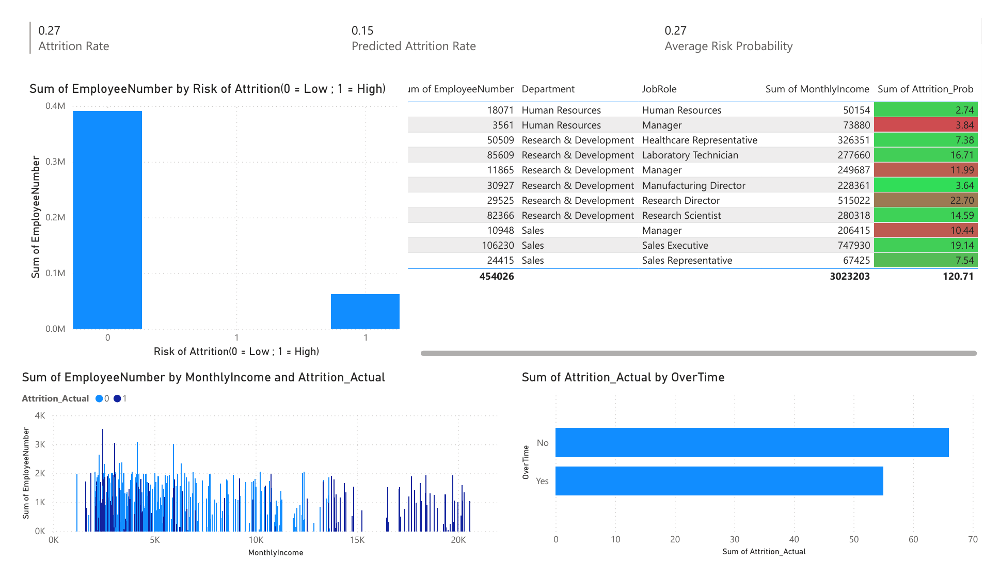

# Employee Attrition Predictions

## Project Overview

This project uses employee data to predict workforce attrition and identify
patterns associated with employee turnover. Two HR datasets were merged,
prepared for modeling, and evaluated using Random Forest and AdaBoost
classification models. The resulting predictions and risk probabilities were
then incorporated into a Power BI dashboard.

## Dataset

The analysis contains 1,470 employee records across 30 merged source fields,
including employment history, compensation, satisfaction, overtime, job role,
and attrition status.

The two CSV files were provided for DAT-430 coursework. Confirm that your
course permits redistribution before making the repository public.

## Workflow

1. Merge the two HR datasets on `EmployeeNumber`.
2. Engineer an income indicator and encode categorical variables.
3. Create a stratified 70/30 training and test split.
4. Train Random Forest and AdaBoost classification models.
5. Evaluate accuracy, precision, recall, F1 score, and ROC AUC.
6. Export predictions and risk probabilities for Power BI.

## Results

AdaBoost produced the strongest test performance:

- Test accuracy: **88.4%**
- F1 score: **0.765**
- ROC AUC: **0.904**

## Dashboard



[Open the dashboard PDF](reports/Employee_Attrition_Dashboard.pdf)

## Tools

- Python
- pandas and NumPy
- scikit-learn
- Matplotlib and Plotly
- Power BI
- Jupyter Notebook

## Repository Structure

```text
Employee Attrition Predictions/
|-- data/
|   |-- HRData1.csv
|   `-- HRData2.csv
|-- notebooks/
|   `-- Employee_Attrition_Predictions.ipynb
|-- reports/
|   |-- Employee_Attrition_Dashboard.pdf
|   `-- Employee_Attrition_Dashboard.png
|-- .gitignore
|-- README.md
`-- requirements.txt
```

## Run the Project

Create a virtual environment and install the project dependencies:

```bash
python -m venv .venv
python -m pip install -r requirements.txt
```

Open `notebooks/Employee_Attrition_Predictions.ipynb` and run all cells. The
generated prediction files will be written to an ignored `outputs` folder. The
dependency versions are pinned because later scikit-learn releases changed the
default AdaBoost implementation.
